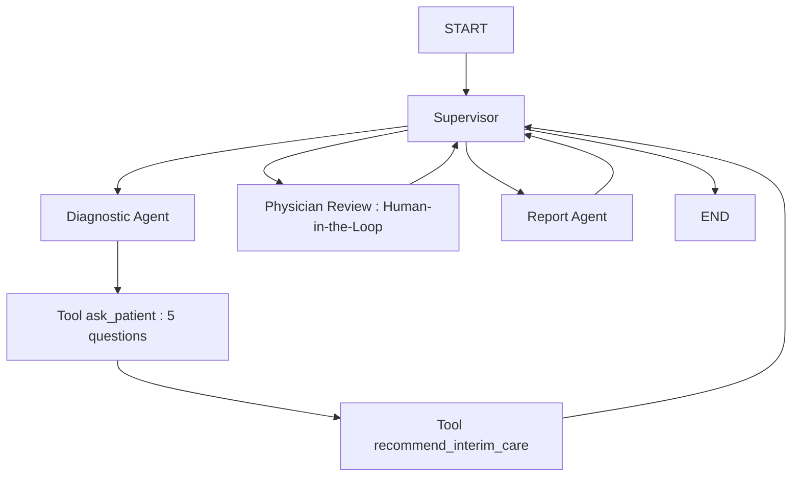

# Rapport de projet : Systeme multi-agents medical avec LangGraph

## 1. Presentation generale

Ce projet est une application academique qui simule un workflow d'orientation clinique preliminaire avec un systeme multi-agents. Il utilise LangGraph pour orchestrer les agents, FastAPI pour exposer le backend, MCP pour fournir un outil externe de reference, OpenAI via LangChain pour generer les textes cliniques, et Streamlit pour l'interface utilisateur.

> Mention obligatoire : Ce systeme ne remplace pas une consultation medicale.

Le systeme ne fournit pas de diagnostic definitif. Il produit une synthese clinique preliminaire, une recommandation intermediaire prudente, puis un rapport final apres validation humaine par un medecin traitant.

## 2. Objectifs du projet

Les objectifs principaux sont :

- modeliser un workflow multi-agents avec LangGraph ;
- gerer un etat partage entre les agents ;
- integrer des tools pour les questions patient et les recommandations ;
- ajouter une etape Human-in-the-Loop pour le medecin ;
- exposer le workflow via une API FastAPI ;
- integrer au moins un outil MCP ;
- connecter un frontend pour utiliser l'application ;
- tester le graphe dans LangGraph Studio ;
- documenter le projet dans un README sous forme de rapport avec captures d'ecran.

## 3. Technologies utilisees

| Partie | Technologie |
| --- | --- |
| Orchestration multi-agents | LangGraph |
| Agents et LLM | LangChain, OpenAI |
| API backend | FastAPI |
| Validation humaine | Interruptions LangGraph |
| Integration externe | MCP |
| Frontend | Streamlit |
| Documentation API | Swagger UI FastAPI |
| Gestion du code | Git, GitHub |

## 4. Architecture du projet

```text
project/
├── backend/
│   ├── app/
│   │   ├── api.py
│   │   ├── graph.py
│   │   ├── llm.py
│   │   ├── state.py
│   │   ├── nodes/
│   │   │   ├── supervisor.py
│   │   │   ├── diagnostic_agent.py
│   │   │   ├── physician_review.py
│   │   │   └── report_agent.py
│   │   └── tools/
│   │       ├── patient_tools.py
│   │       ├── care_tools.py
│   │       └── mcp_client.py
│   ├── .env.example
│   ├── langgraph.json
│   └── requirements.txt
├── mcp_server/
│   ├── server.py
│   └── data/
│       └── red_flags.md
├── frontend/
│   └── streamlit_app.py
├── docs/
│   └── screenshots/
└── README.md
```

## 5. Workflow fonctionnel

Le workflow suit le scenario demande dans le cahier des charges :

1. L'utilisateur saisit le cas initial du patient.
2. Le `Supervisor` oriente le workflow vers le `Diagnostic Agent`.
3. Le `Diagnostic Agent` pose 5 questions successives au patient.
4. Les reponses sont stockees dans l'etat partage du graphe.
5. Le systeme genere une synthese clinique preliminaire.
6. Le systeme produit une recommandation intermediaire prudente.
7. Le workflow s'interrompt pour la revue du medecin traitant.
8. Le medecin saisit un traitement ou une conduite a tenir.
9. Le `Report Agent` genere le rapport final structure.
10. Le `Supervisor` termine le workflow.



## 6. Etat partage LangGraph

L'etat partage est defini dans `backend/app/state.py`. Il contient les informations necessaires au suivi de la consultation.

Champs principaux :

- `messages` : historique des messages ;
- `next` : prochaine etape choisie par le superviseur ;
- `thread_id` : identifiant de consultation ;
- `initial_case` : cas initial du patient ;
- `questions` : liste des 5 questions posees ;
- `patient_answers` : reponses du patient ;
- `question_count` : nombre de questions posees ;
- `interim_care` : recommandation intermediaire ;
- `diagnostic_summary` : synthese clinique preliminaire ;
- `physician_treatment` : validation ou conduite a tenir du medecin ;
- `final_report` : rapport final.

## 7. Description des agents

### 7.1 Supervisor

Fichier : `backend/app/nodes/supervisor.py`

Le `Supervisor` orchestre le workflow. Il decide la prochaine etape selon l'etat courant :

- si la synthese clinique n'existe pas encore, il lance le `Diagnostic Agent` ;
- si la revue medecin n'existe pas encore, il lance `Physician Review` ;
- si le rapport final n'existe pas encore, il lance le `Report Agent` ;
- sinon, il termine le graphe.

### 7.2 Diagnostic Agent

Fichier : `backend/app/nodes/diagnostic_agent.py`

Le `Diagnostic Agent` gere l'interaction patient. Il pose exactement 5 questions via le tool `ask_patient`, puis genere une synthese clinique preliminaire.

Ses responsabilites :

- poser 5 questions successives ;
- collecter les reponses ;
- appeler la reference de signes d'alerte ;
- generer la synthese clinique preliminaire avec OpenAI si la cle API est configuree ;
- utiliser un fallback local si aucune cle API n'est disponible ;
- produire la recommandation intermediaire.

### 7.3 Physician Review

Fichier : `backend/app/nodes/physician_review.py`

Cette etape represente le Human-in-the-Loop obligatoire. Le graphe s'interrompt et attend l'intervention du medecin traitant.

Le medecin recoit :

- la synthese clinique preliminaire ;
- la recommandation intermediaire ;
- une zone de saisie pour proposer un traitement ou une conduite a tenir.

### 7.4 Report Agent

Fichier : `backend/app/nodes/report_agent.py`

Le `Report Agent` genere le rapport final structure. Il utilise OpenAI si la cle API est disponible, sinon il produit un rapport local structure.

Le rapport contient :

- le cas initial ;
- la synthese clinique preliminaire ;
- la recommandation intermediaire ;
- la revue du medecin traitant ;
- la mention ethique obligatoire.

## 8. Tools internes

### 8.1 Tool `ask_patient`

Fichier : `backend/app/tools/patient_tools.py`

Ce tool fournit les 5 questions obligatoires posees au patient :

1. debut des symptomes ;
2. intensite ;
3. presence de fievre, gene respiratoire ou douleur ;
4. antecedents, allergies ou traitements ;
5. aggravation ou signes inhabituels.

### 8.2 Tool `recommend_interim_care`

Fichier : `backend/app/tools/care_tools.py`

Ce tool genere une recommandation intermediaire prudente. Il detecte certains signes d'alerte dans le cas initial et les reponses patient.

Exemples de recommandations :

- repos, hydratation, surveillance ;
- consultation rapide si aggravation ;
- attention particuliere si presence de douleur thoracique, difficulte respiratoire, confusion, saignement ou forte fievre.

## 9. Integration OpenAI

Fichier : `backend/app/llm.py`

L'integration OpenAI passe par LangChain avec `ChatOpenAI`.

Variables d'environnement :

```env
OPENAI_API_KEY=sk-votre-cle-api-ici
OPENAI_MODEL=gpt-4o-mini
```

Le fichier reel `backend/.env` doit rester local et ne doit jamais etre pousse sur GitHub. Le fichier `backend/.env.example` sert uniquement de modele.

Utilisation dans le projet :

- `Diagnostic Agent` : generation de la synthese clinique preliminaire ;
- `Report Agent` : generation du rapport final.

Si la cle API n'existe pas, le projet continue a fonctionner avec des textes generes localement.

## 10. Integration MCP

Fichier : `mcp_server/server.py`

Le projet contient un serveur MCP minimal nomme `medical-reference-tools`. Il expose l'outil :

```text
red_flags_reference
```

Cet outil retourne une liste de signes d'alerte generaux :

- douleur thoracique ;
- difficulte respiratoire ;
- confusion ;
- malaise important ;
- saignement ;
- forte fievre persistante.

La reference est aussi documentee dans `mcp_server/data/red_flags.md`.

## 11. API FastAPI

Fichier : `backend/app/api.py`

L'API permet de demarrer une consultation, reprendre le graphe apres chaque interruption, consulter l'etat courant et recuperer le rapport final.

| Methode | Endpoint | Role |
| --- | --- | --- |
| POST | `/sessions/start` | Creer un identifiant de session |
| POST | `/consultation/start` | Demarrer une consultation |
| POST | `/consultation/resume` | Reprendre apres une interruption |
| GET | `/consultation/{thread_id}` | Lire l'etat d'une consultation |
| GET | `/consultation/{thread_id}/report` | Recuperer le rapport final |

Exemple de demarrage :

```json
{
  "initial_case": "Patient avec toux et fatigue depuis 2 jours"
}
```

Exemple de reprise :

```json
{
  "thread_id": "identifiant-consultation",
  "answer": "Les symptomes ont commence il y a 2 jours"
}
```

## 12. Frontend Streamlit

Fichier : `frontend/streamlit_app.py`

Le frontend permet d'utiliser le workflow sans appeler directement l'API.

Ecrans couverts :

- saisie du cas initial patient ;
- affichage des questions patient ;
- saisie des reponses patient ;
- revue medecin avec synthese et recommandation ;
- affichage du rapport final.

## 13. Installation

Depuis la racine du projet :

```bash
cd backend
python -m venv .venv
.venv\Scripts\activate
pip install -r requirements.txt
```

Creer ensuite le fichier `backend/.env` :

```env
OPENAI_API_KEY=sk-votre-cle-api-ici
OPENAI_MODEL=gpt-4o-mini
```

## 14. Execution

### 14.1 Lancer l'API FastAPI

```bash
cd backend
uvicorn app.api:app --reload --port 8000
```

Documentation Swagger :

```text
http://127.0.0.1:8000/docs
```

### 14.2 Lancer le frontend

Dans un deuxieme terminal :

```bash
cd frontend
streamlit run streamlit_app.py
```

Adresse par defaut :

```text
http://localhost:8501
```

### 14.3 Lancer le serveur MCP

Depuis la racine du projet :

```bash
python mcp_server/server.py
```

### 14.4 Lancer LangGraph Studio

Depuis le dossier `backend` :

```bash
langgraph dev
```

Le fichier `backend/langgraph.json` declare le graphe :

```json
{
  "dependencies": ["."],
  "graphs": {
    "medical_orientation": "./app/graph.py:graph"
  },
  "env": ".env"
}
```

## 15. Tests realises

Le workflow a ete teste avec les points suivants :

- demarrage d'une consultation ;
- interruption patient pour chacune des 5 questions ;
- stockage des reponses dans l'etat ;
- generation de la synthese clinique preliminaire ;
- generation de la recommandation intermediaire ;
- interruption Human-in-the-Loop pour le medecin ;
- generation du rapport final ;
- recuperation du rapport via API.

## 16. Jeux de tests attendus

### Cas 1 : syndrome respiratoire simple

Cas initial :

```text
Toux, nez qui coule, fatigue legere depuis 2 jours, pas de gene respiratoire.
```

Resultat attendu :

- 5 questions patient ;
- recommandation repos, hydratation et surveillance ;
- revue medecin ;
- rapport final.

### Cas 2 : cas avec signes d'alerte

Cas initial :

```text
Fievre elevee persistante avec difficulte respiratoire et douleur thoracique.
```

Resultat attendu :

- 5 questions patient ;
- recommandation de consultation rapide ;
- revue medecin prioritaire ;
- rapport final prudent.

### Cas 3 : cas benin

Cas initial :

```text
Leger mal de tete apres une journee de travail, pas de fievre, pas d'autre symptome.
```

Resultat attendu :

- 5 questions patient ;
- recommandation generale de repos et surveillance ;
- revue medecin ;
- rapport final.

## 17. Captures d'ecran

Ajouter les captures dans `docs/screenshots/`.

### 17.1 LangGraph Studio


### 17.2 API FastAPI


### 17.3 Frontend Streamlit


### 17.4 Questions patient


### 17.5 Revue medecin


### 17.6 Rapport final


## 18. Securite et ethique

Le projet respecte les contraintes pedagogiques suivantes :

- il ne se presente pas comme un dispositif medical ;
- il ne fournit pas de diagnostic definitif ;
- il utilise les termes orientation clinique preliminaire et recommandation intermediaire ;
- il inclut une validation humaine obligatoire ;
- il mentionne explicitement que le systeme ne remplace pas une consultation medicale ;
- il ne doit pas publier la cle API OpenAI.

## 19. Gestion Git et GitHub

Le projet est versionne avec Git. Les commits doivent montrer l'avancement progressif :

```bash
git status
git add .
git commit -m "Message du commit"
```

Le repository GitHub doit etre prive et partage avec le professeur :

```text
m.youssfi@enset-media.ac.ma
```

Important :

- ne jamais pousser `backend/.env` ;
- pousser seulement `backend/.env.example` ;
- verifier les fichiers avec `git status` avant chaque push ;
- ajouter les captures dans `docs/screenshots/` avant le rendu final si elles doivent apparaitre dans le README.

## 20. Conclusion

Ce projet implemente un systeme multi-agents medical pedagogique conforme au cahier des charges. Il combine LangGraph, FastAPI, MCP, OpenAI et Streamlit pour simuler une consultation encadree, avec collecte patient, synthese preliminaire, recommandation prudente, intervention du medecin et generation d'un rapport final.

Le systeme reste volontairement prudent : il assiste l'orientation clinique mais ne remplace jamais l'avis d'un professionnel de sante.
